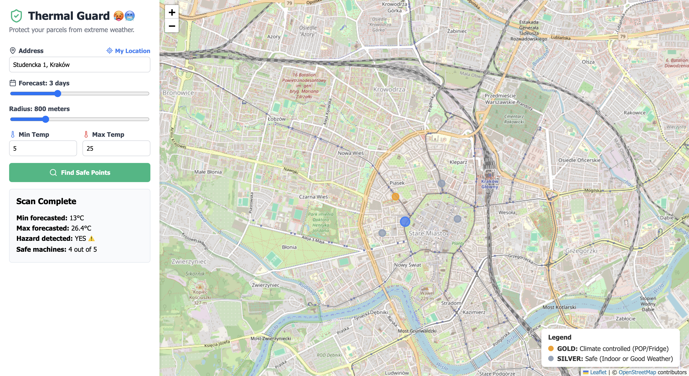
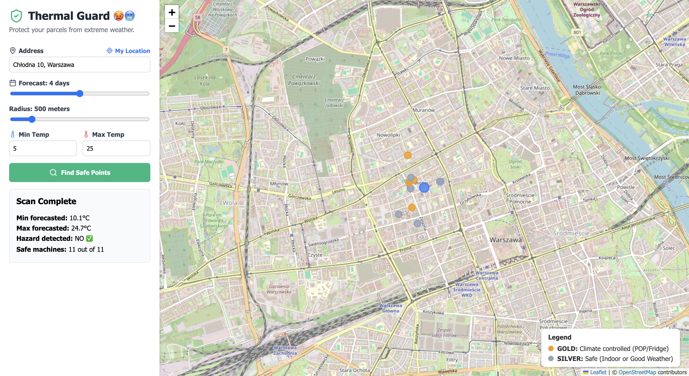
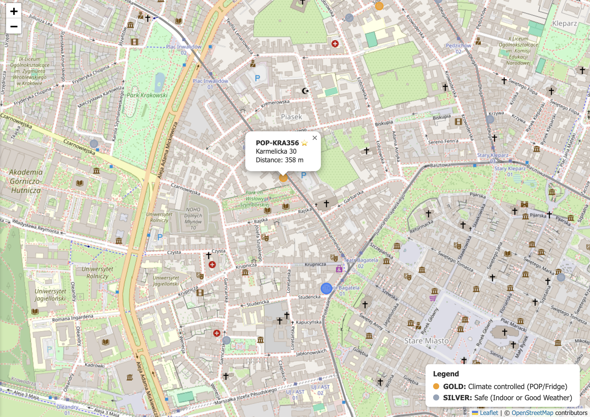
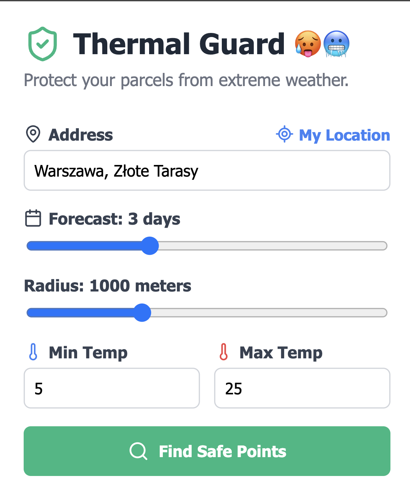

# Thermal Guard 🥵🥶

## Author

- **Name:** Maciej Kaniewski
- **Email:** maciejkaniewski@op.pl

## Overview

Thermal Shield is a full-stack application that helps users find temperature-safe InPost parcel lockers for weather-sensitive shipments (e.g., cosmetics, medicines, electronics). By combining the InPost API with real-time weather forecasts, it evaluates nearby lockers and categorizes them based on their thermal safety, preventing items from freezing or melting while waiting for pickup.

## Demo & Description

When ordering temperature-sensitive items, standard outdoor parcel lockers can become a hazard during heatwaves or freezing winters. **Thermal Guard** solves this specific problem.

**How it works:**

1. The user inputs their address (or lets the browser detect it automatically) and sets their safe temperature limits (e.g., 5°C to 25°C), the search radius, and the expected package waiting time (1-7 days).
2. The application fetches the location coordinates (via Nominatim API) and the weather forecast for the upcoming days (via Open-Meteo API).
3. The backend fetches nearby InPost points and runs them through the `ThermalEvaluator`.
4. Lockers are categorized into three safety levels:
   - 🌟 **GOLD (Climate Controlled):** POPs (Points of Package) or refrigerators. 100% safe regardless of the weather.
   - 📦 **SILVER (Safe):** Standard lockers that are either located indoors (malls, offices) or outdoor lockers when the forecasted weather is mild.
   - 🥵🥶 **DANGER (Extreme Weather Risk):** Outdoor lockers exposed to the elements during forecasted extreme temperatures (not shown on map when temperature is considered harmful).

**Technical Architecture & Approach:**
I decided to build a lightweight microservice architecture.

- The **Backend (FastAPI)** acts as an orchestrator. It fetches raw data from three different external APIs (including Inpost), calculates precise distances to parcel lockers and evaluates the thermal logic..
- The **Frontend (React)** is focused purely on presentation. I used also `react-leaflet` for map rendering.


### Screenshots

Below are snapshots of the application in action, demonstrating its dynamic response to different weather conditions.

**1. Extreme Weather Alert (Hazard Detected)**
When the forecasted temperatures exceed user-defined limits, the app detects a hazard (⚠️) and helps the user locate fully climate-controlled (Gold) or safe indoor (Silver) machines.


**2. Optimal Weather (No Hazard)**
When the weather is mild, the hazard alert clears (✅), indicating that standard outdoor lockers are also perfectly safe to use for sensitive parcels.


**3. Interactive Map Details**
Clicking on any marker reveals the locker's exact ID, address, and precisely calculated distance in meters from the searched location.


**4. User Control Panel**
A clean, intuitive interface allowing users to adjust their temperature tolerances, search radius, and forecast duration. It is also possible to automatically detect user location.


## Technologies

**Frontend:**

- **React (TypeScript) & Vite:** For a fast, strictly typed, and responsive user interface.
- **React-Leaflet:** A powerful, lightweight wrapper for Leaflet maps.
- **Lucide-React:** For clean, modern iconography.

**Backend:**

- **Python 3.13 & FastAPI:** Chosen for its fast performance and built-in asynchronous capabilities, which is crucial when orchestrating multiple external API calls simultaneously.
- **Httpx:** A fully async HTTP client for fetching external data.
- **Geopy:** For accurate geospatial distance calculations.

**Infrastructure:**

- **Docker & Docker Compose:** Multi-stage builds are used to keep the final images small. The `uv` package manager was used in the Python container for fast dependency resolution.

## How to run

### Prerequisites

To run this project, you only need:

- Docker
- Docker Compose
- Available ports `8000` (backend) and `3000` (frontend) on your machine.

### Build & run

```bash
git clone https://github.com/mkan1ewski/parcel-thermal-guard
cd parcel_thermal_guard

docker compose up --build -d

# Access the application
# http://localhost:3000

```

## What I would do with more time

I would focus on improving the user experience with two specific features:

1. **Direct Navigation:** Add a "Take me there" button inside the map popup that seamlessly opens Google Maps with the locker's exact coordinates.
2. **Locker Photos:** The InPost API provides image URLs for the machines. I would fetch and display these photos inside the UI/popup to make it easier for users to visually spot the machine on the street.

## AI usage

I used AI tools mainly to quickly write CSS styles, set up boilerplates, explore different possibilities and to polish readme. The core concept, business logic, and architectural choices were my own. All AI-generated code was thoroughly reviewed and adapted to fit the project's specific requirements.
